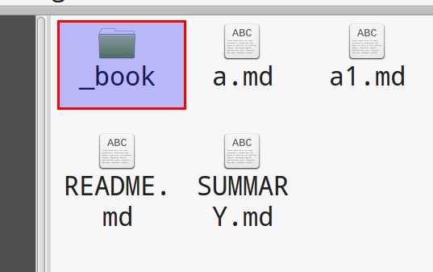
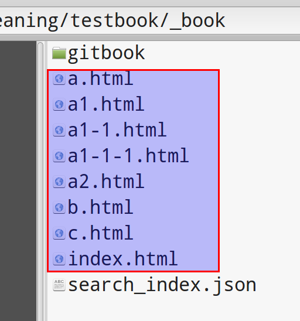
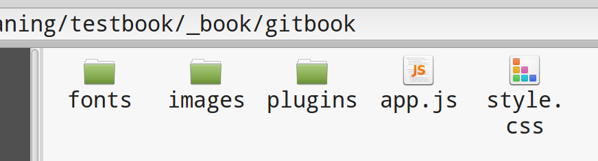

# 生成的文件

## 背景介绍

在执行 `gitbook serve` 命令之后， gitbook 会从当前的原始内容中先生成HTML内容，然后启动一个内建的web服务器，将生成的这些内容作为网站内容提供HTTP访问服务。

回顾一下命令 `gitbook serve` 的输出：

    Live reload server started on port: 35729
    Press CTRL+C to quit ...

    info: loading book configuration....OK
    info: load plugin gitbook-plugin-highlight ....OK
    info: load plugin gitbook-plugin-search ....OK
    info: load plugin gitbook-plugin-sharing ....OK
    info: load plugin gitbook-plugin-fontsettings ....OK
    info: load plugin gitbook-plugin-livereload ....OK
    info: >> 5 plugins loaded
    info: start generation with website generator
    info: clean website generatorOK
    info: generation is finished

    Starting server ...
    Serving book on http://localhost:4000

其中下面的三行是和内容生成有关：

    info: start generation with website generator
    info: clean website generatorOK
    info: generation is finished

最后两行是在启动web服务器：

    Starting server ...
    Serving book on http://localhost:4000

## 生成的文件

此时去看数据目录，会发现除了之前的各种markdown文件外，还有一个 `_book` 目录：

进入 `_book` 目录：

里面红框中的是 markdown 文件生成的对应的 HTML 文件，文件名一一对应（如果有目录则目录也是一一对应）。

另外 index.html 是默认首页，包括

1. 左侧的导航栏：内容来自 SUMMARY.md
2. 左边的正文：内容来自 README.md

另外还有一个 gitbook 的目录，里面内容是 gitbook 自身的js/css/图片/字体/插件等文件：

## 总结

在build完成之后， `_book` 目录下其实就已经有了整个数据的完成的生成文件，这些文件已经足够用于展示和发布。

> 注： 可以直接用浏览器打开 index.html 文件开始浏览

在之后，gitbook的web服务器将使用这些文件提供web浏览服务，而在之后的发布过程中，这些生成的文件就将用于发布。

