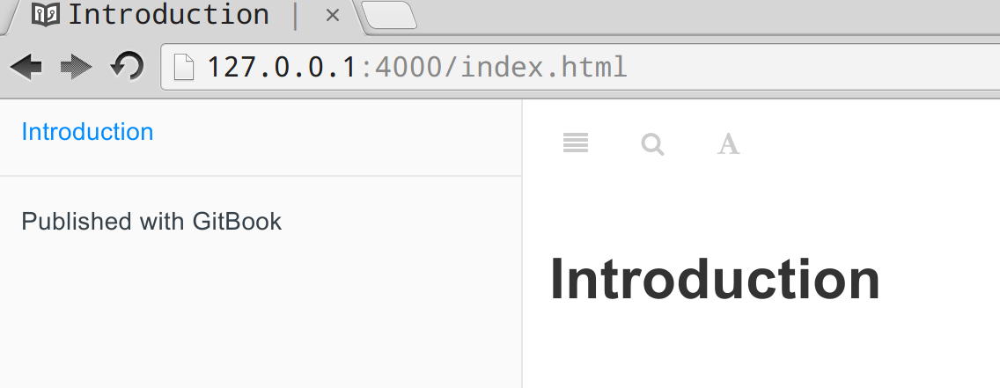
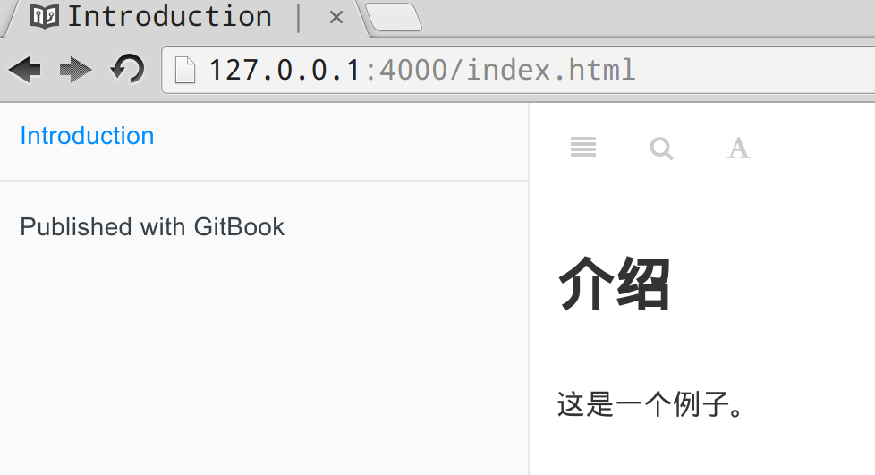

创建书籍
=======

## 初始化书籍

执行命令 `gitbook init testbook` ,则会自动生成一个最基本的书籍骨架：

    $ gitbook init testbook

    info: init book at testbook
    info: detect structure from SUMMARY (if it exists)
    info: create SUMMARY.md
    info: create README.md
    info: initialization is finished

    Done, without error

进入 testbook 目录，可以看到只有两个文件：

    $ cd testbook/
    $ ls
    README.md  SUMMARY.md

其中 SUMMARY.md 是书籍的目录和排版，目前文件为空，里面只有一行注释：

	# Summary

README.md 是书籍的介绍信息，目前只有一个标题：

	# Introduction

## 查看内容

即使如此简陋，也足以运行。

在 testbook 目录下运行命令 `gitbook serve`

    Live reload server started on port: 35729
    Press CTRL+C to quit ...

    info: loading book configuration....OK
    info: load plugin gitbook-plugin-highlight ....OK
    info: load plugin gitbook-plugin-search ....OK
    info: load plugin gitbook-plugin-sharing ....OK
    info: load plugin gitbook-plugin-fontsettings ....OK
    info: load plugin gitbook-plugin-livereload ....OK
    info: >> 5 plugins loaded
    info: start generation with website generator
    info: clean website generatorOK
    info: generation is finished

    Starting server ...
    Serving book on http://localhost:4000

此时打开浏览器，输入地址 `http://localhost:4000`：

## 修改

修改README.md 文件为：

    # 介绍

    这是一个例子。

这是浏览器会自动刷新（Live reload，见上面的命令行输出），非常方便：

> 注： gitbook 使用markdown语法来编写书籍内容，具体的markdown语法请自行学习。

后面介绍如何增加新的章节。

