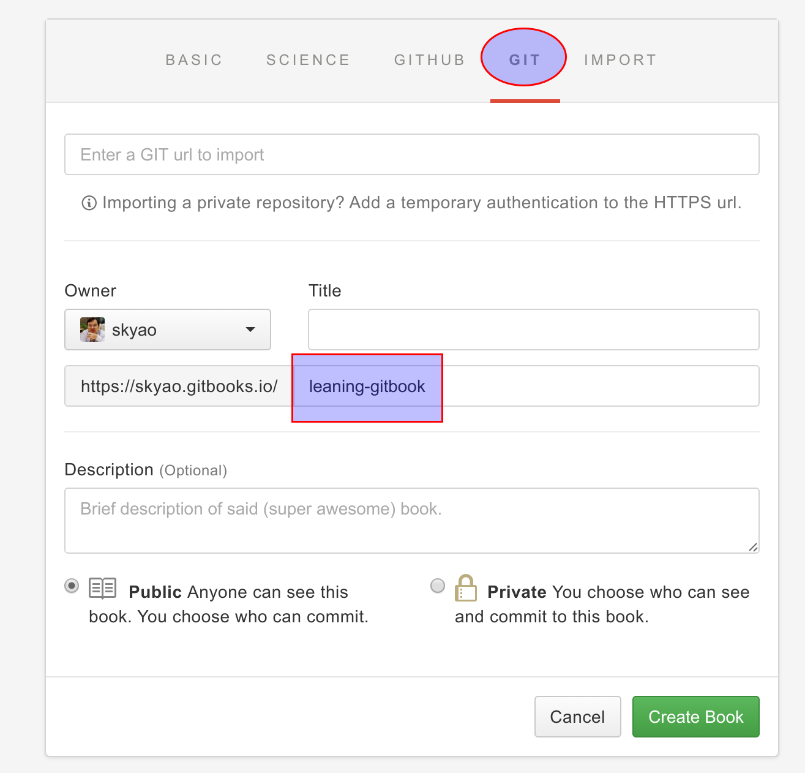

# gitbook方案

github方案是指采用gitbook提供的git仓库存储书籍内容，并使用gitbook发布HTML内容。

和github方案类似，同样适合用于公共环境，比如存放一些公开信息。差异只是用github还是gitbook。

操作方式比较简单，gitbook官网提供了全套一条龙服务。

## 准备

先在gitbook网站注册/登录/设置好个人基本信息，如果有github帐号可以选择用github帐号登录。

https://www.gitbook.com/

## 具体操作

在gitbook网站，登录后点"MYBOOKS" -> "New Book"。

在"BASIC"里面填写基本信息：

然后点"GIT"(注意不是github!),然后填写git仓库的名字。

后面的操作就不详细讲解了，非常简便。