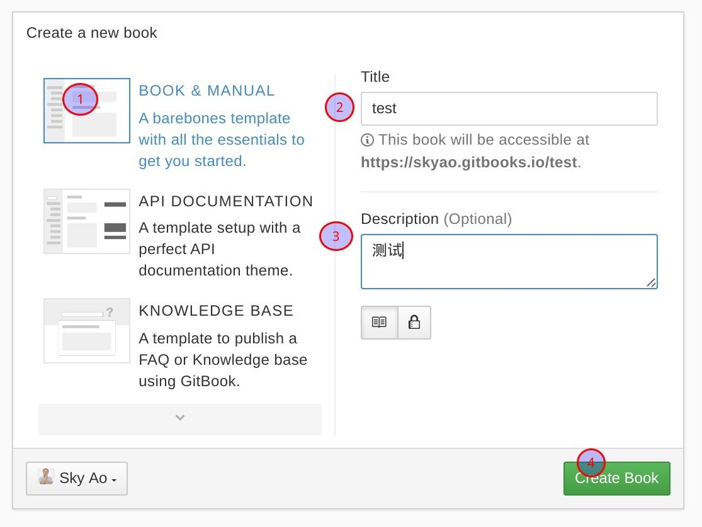
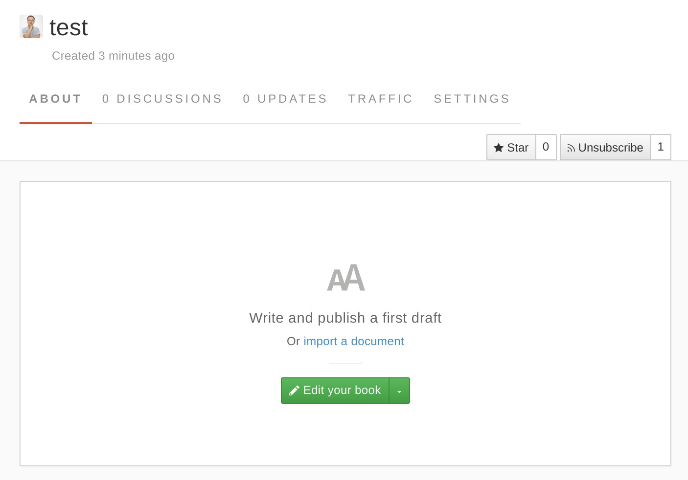

# gitbook方案

tags: gitbook

github方案是指采用gitbook提供的git仓库存储书籍内容，并使用gitbook发布HTML内容。

和github方案类似，同样适合用于公共环境，比如存放一些公开信息。差异只是用github还是gitbook。

操作方式比较简单，gitbook官网提供了全套一条龙服务。

## 准备

先在gitbook网站注册/登录/设置好个人基本信息，如果有github帐号可以选择用github帐号登录。

https://www.gitbook.com/

## 具体操作

在gitbook网站，登录后点"MYBOOKS" -> "New Book"。

按照图片中的数字顺序，先后：

1. 选择"BOOK & MANUAL"
2. 填写title
3. 填写描述
4. 点击"create book"开始创建

注意不需要选择其他，默认就是在 gitbook 的 git 中为这本书新建一个仓库，然后页面显示书籍创建成功，可以开始内容添加：

