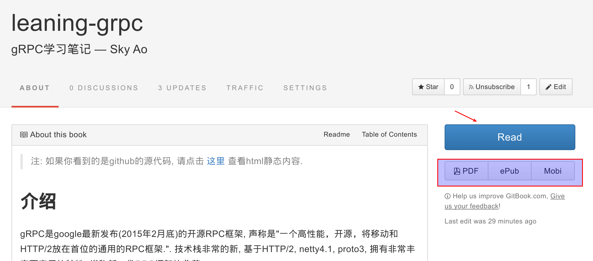

# 发布书籍

这一节中，我们将介绍如何发布书籍。

## 工作方式

在发布书籍之前，需要先了解 gitbook 的基本工作方式。

首先，gitbook中有两种内容：

1. 书籍的原始内容： 以markdown格式编写的文本内容，和其他诸如图片等附加文件
2. 书籍的展现内容： 最常见的是HTML格式，也可以生成PDF/ePub/mobi格式

如上图所示，点击箭头所指之处可以看到 HTML 格式，下面红框里面可以下载到 PDF/ePub/mobi 格式的书籍文件。

第一种内容用于编辑和存储，第二种内容用于展现和发布。

然后 gitbook 提供工具（包括本地命令行和官方网站）从原始内容生成展现内容。

## 存储方式

对应上述的工作方式，gitbook在存储内容时也分成两块。

### 对书籍原始内容的存储

典型就是存储在git仓库中：

1. github，大家最熟悉的
2. gitbook官网提供的git仓库
3. 自己的或者公司的私有git仓库，典型如使用gitlab搭建

视具体情况选择，其中github和gitbook的仓库都是public可以免费使用，private需要收费。

### 对书籍展现内容的存储

gitbook生成的展现内容，它的存储和发布的方式有以下几种：

1. 私有web服务器

	典型如 HTML 文件，是一些静态内容，因此只要能提供一个最普通最简单的 web 服务器就可以。比如apache/nginx等。

    这种方式特别适合一些私有信息的发布，比如在公司内部。

2. github pages

	github pages是github推出的免费服务，特别使用用来存放各种静态站点，一般多用于个人blog或者项目文档等。具体介绍可以参考这里：[GitHub Pages](http://jekyllcn.com/docs/github-pages/)，虽然是介绍Jekyll，不过方式可以通用于其他类似方案，比如我喜欢的blog工具hexo和今天介绍的gitbook。

    简单一句话介绍说github pages的使用： 只要在对应github仓库上建立分支 `gp-pages` ,然后将静态web文件提交到这个分支，github就会以 `http://yourid.github.io/yourproject/` 的URL提供web服务，例如 http://skyao.github.io/leaning-grpc/。

	这个方式配合 github 的免费git仓库，堪称绝配。

3. gitbook官网

	在gitbook官网，提供gitbook使用的全套服务，自然也包括数据的发布。而且编辑存储发布是一条龙服务，非常方便。

    此外，gitbook的build内容时，会自动生成 PDF/ePub/mobi 格式的文件并提供下载服务，这点比用github方便。

## 搭配方案

理论上说，上述列举的存储方案和展现方案是可以任意搭配使用的，即 3 × 3 = 9 种方案。

实际上，比较推荐的方案是：

1. 私有git仓库存储 + 私有web服务器发布

	这种方式适合用于私有环境，比如公司内部(当然如果购买了github和gitbook的收费服务不在此列)。

    搭建一个gitlab，存放一些以gitbook格式存放的开发文档，然后通过ci服务器（如jenkins）监控更新并生成HTML内容，再部署到nginx/apache等web服务器。

2. github仓库存储 + github pages发布

	这是github提供的一条龙服务，也是我之前使用的典型方案。

    好处是方便，够简单，也直白，缺点是不能直接生成 PDF/ePub/mobi 格式， 而且内容更新之后需要自己手工发布（虽然理论上也可以用jenkins自动跑）。

3. gitbook仓库存储 + gitbook发布

	这是 gitbook 推荐的方式。

    用起来很方便，而且提供前面说的直接生成 PDF/ePub/mobi 格式的功能。但是最大的问题，是我不习惯将代码存放到github之外的地方。

    > 注：这个方式还有一个额外的好处，就是gitbook被墙的概率要低于github :)

4. github仓库存储 + gitbook发布

	大概是我这种不习惯将代码存放到github之外的人太多，因此gitbook提供了折中方案。

    在gitbook中创建书籍时，可以选择直接使用github的仓库（gitbook提供了和github的集成）做存储，然后继续使用 gitbook 的其他服务包括发布。

## 详细操作

以上四个方案的详细操作，将在下面的章节中展开，逐个介绍如何创建书籍并发布。

> 注：我目前在慢慢将原来方案2的各种学习笔记转为方案4。

