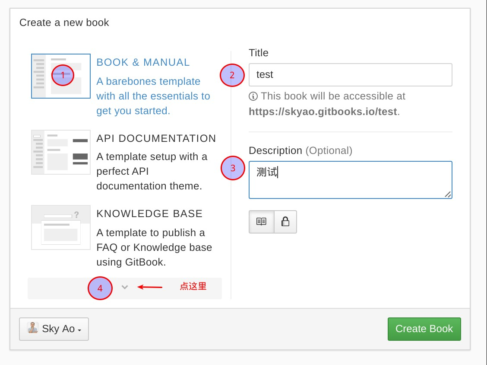
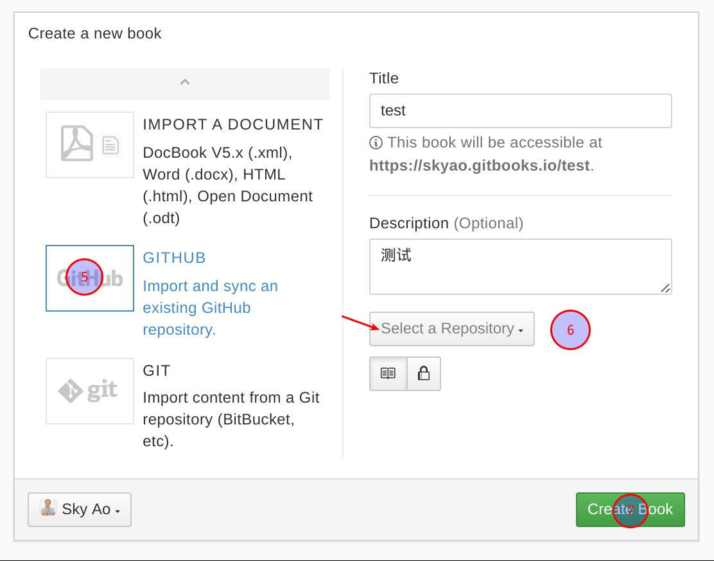
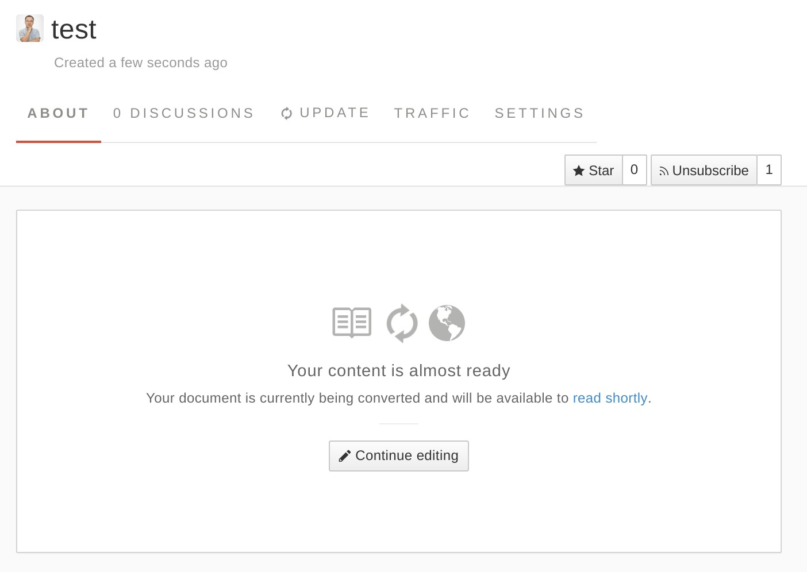
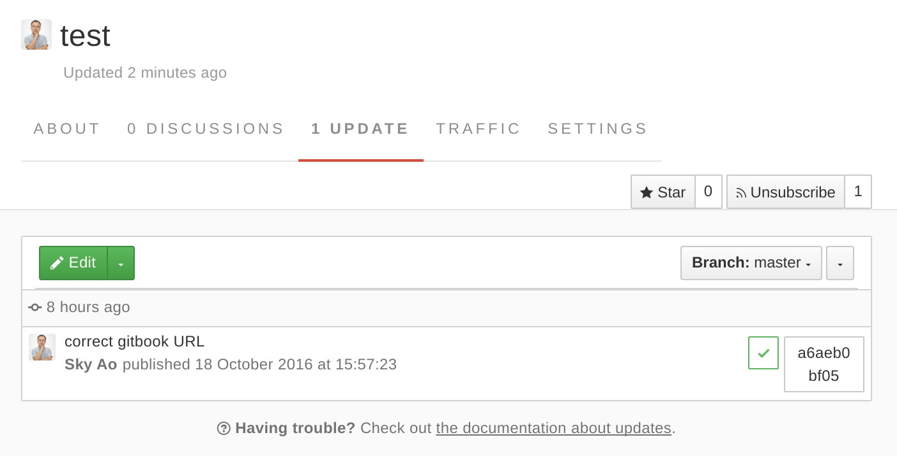
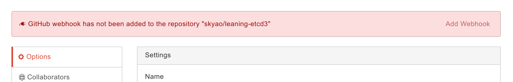
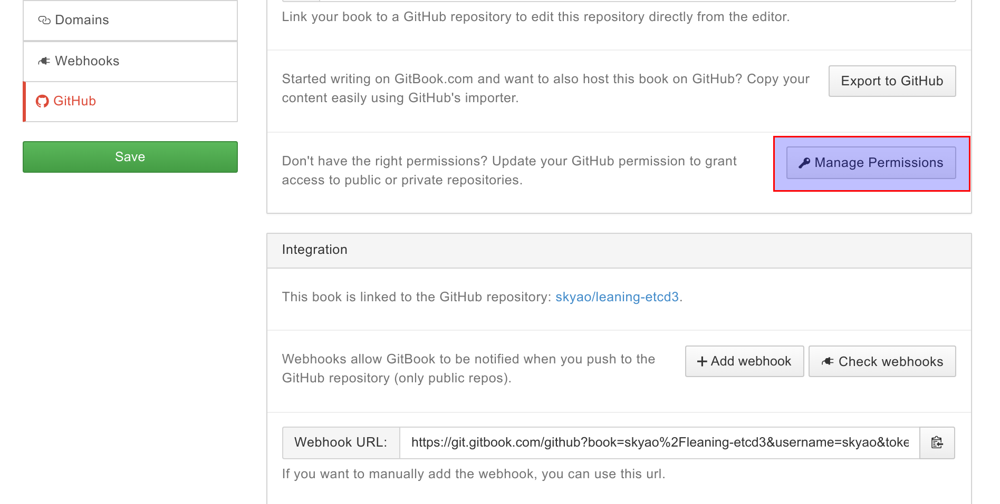
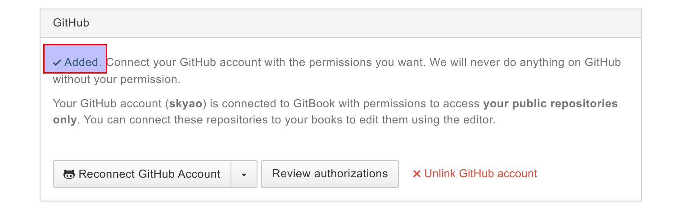

# 混合方案

tags: 混合

github方案是指采用github提供的git仓库存储书籍内容，并使用gitbook发布HTML内容。

可以说是github + gitbook 的混合。

适合于习惯用github做git仓库，又想使用gitbook提供的功能的情况。

## 背景

1. 在github上已经存在gitbook格式的书籍：之前提交并使用github page发布
2. 想在gitbook网站创建新的书籍，但是内容依然继续存放在github原有的git仓库中

## 操作

在gitbook网站，登录后点"MYBOOKS" -> "New Book"。

和前面一样先做 1/2/3 这三个步骤，然后点击红色箭头处：

在左边的三个选择中点"GITHUB", 然后点红色箭头处的下拉框，gitbook会开始链接github获取可选的仓库列表，之后再点下拉框中，就可以选择对应的git仓库：

最后点右下角的"Create Book"，书籍创建成功之后，显示如下：。

表示正在构建书籍的内容，稍等片刻，如果顺利，则显示为build成功。有时gitbook的页面不会及时刷新，可以稍后手工点击"UPDATE"直接看结果：

点"ABOUT"就可以回到书籍首页，再点"READ"可以看到生成的书籍内容的HTML内容。

## 错误处理

### 长时间没有build成功

注意： 如果长时间没有build成功，可以打开书籍的"UPDATES"查看情况：

比如上图中最下面的一个build，显示失败，点击最右边的"dc4c59c546"，可以看到详细的build过程日志输出：

    Downloading source
    Pulling from S3
    Extracting source
    GitBook version is 3.1.1
    Tweaking book.json
    Installing plugins

    ConfigurationError: Error with book's configuration: config.isbn is not of a type(s) string

这里显示 `config.isbn` 配置有误。

打开book.json，发现配置是这样：

    "isbn": null,

因为没有真实的ksbn，所以当时设置了null，这个用本地 gitbook 命令跑起来没有问题，但是 gitbook 官网的build就失败了。

解决方法：非常简单，删除这行，可以看到第二个build成功。

### github webhook未添加

新书籍加入后，有时会报错（进书籍的 Settings），说github webhook未添加到这本书连接的 github 仓库：

此时点击左边的"Github"，再点"Manager Permissions":

如果之前有设置github的 permission， 此时应该会立即显示 "Added" 字样：

再点回这本书籍的 Settings，就可以看到不再报错。