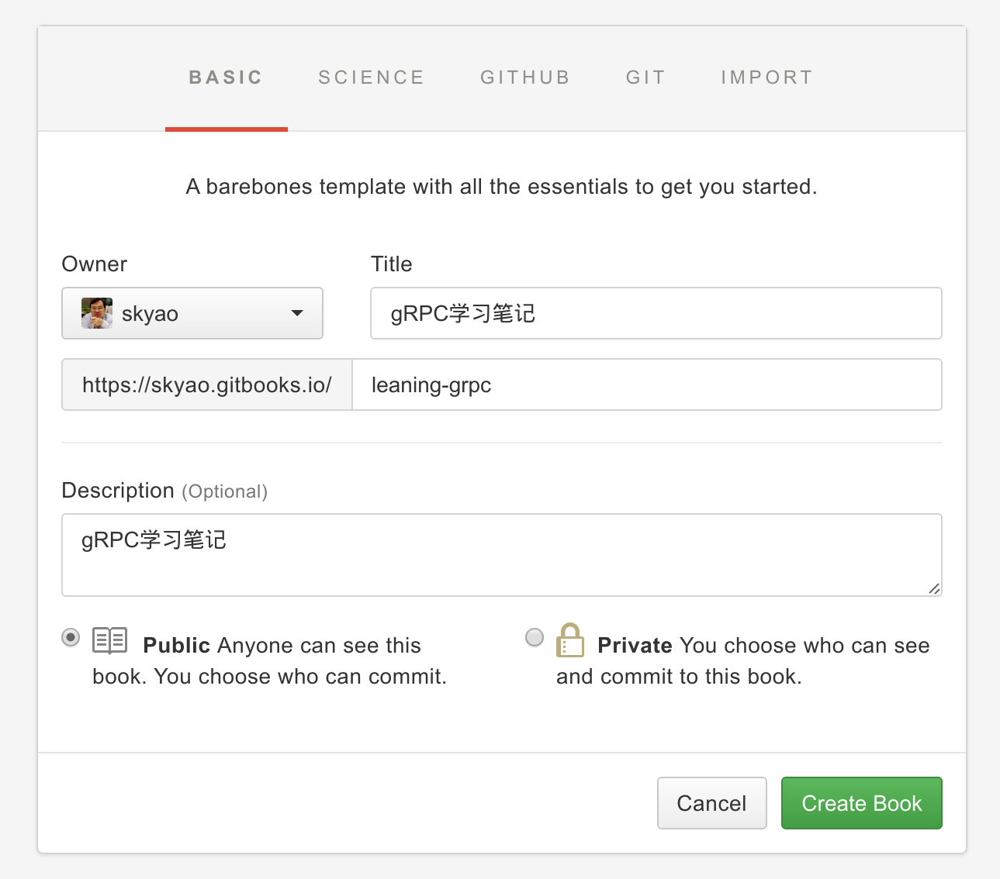
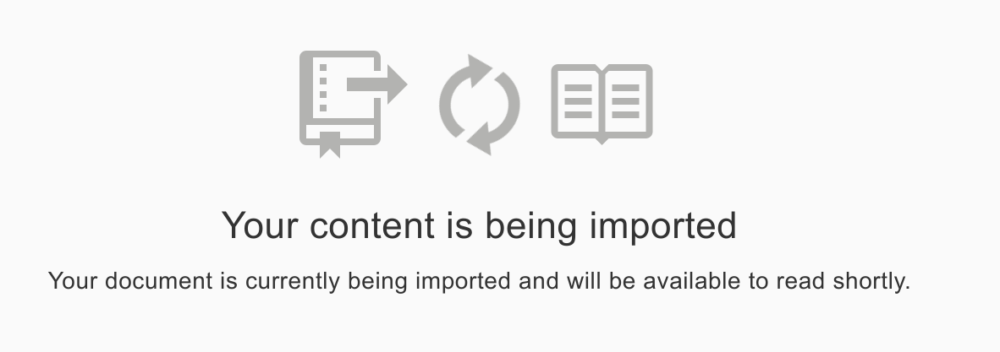
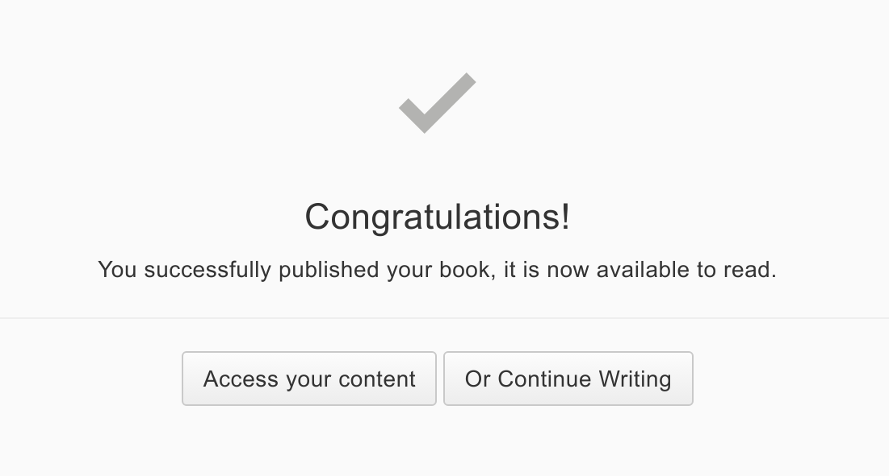
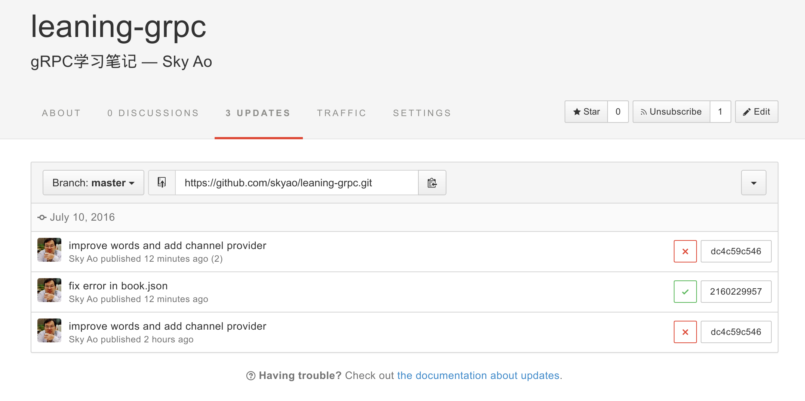

# 从github中导入已有书籍

## 背景

1. 在github上已经存在gitbook格式的书籍：之前提交并使用github page发布
2. 想在gitbook网站创建新的书籍，但是内容依然继续存放在github原有的git仓库中

## 操作

在gitbook网站，登录后点"MYBOOKS" -> "New Book"。

在"BASIC"里面填写基本信息：

然后点"GITHUB",在下拉框中选择对应的git仓库

然后点右下角的"Create Book"。

新的书籍创建之后，就会开始导入github仓库，然后创建可以阅读的内容：

稍等片刻，如果顺利，则显示为build成功。

点"Access your content"就可以看到生成的书籍内容。

## 错误处理

注意： 如果长时间没有build成功，可以打开书籍的"UPDATES"查看情况：

比如上图中最下面的一个build，显示失败，点击最右边的"dc4c59c546"，可以看到详细的build过程日志输出：

    Downloading source
    Pulling from S3
    Extracting source
    GitBook version is 3.1.1
    Tweaking book.json
    Installing plugins

    ConfigurationError: Error with book's configuration: config.isbn is not of a type(s) string

这里显示 `config.isbn` 配置有误。

打开book.json，发现配置是这样：

    "isbn": null,

因为没有真实的ksbn，所以当时设置了null，这个用本地 gitbook 命令跑起来没有问题，但是 gitbook 官网的build就失败了。

解决方法：非常简单，删除这行，可以看到第二个build成功。
